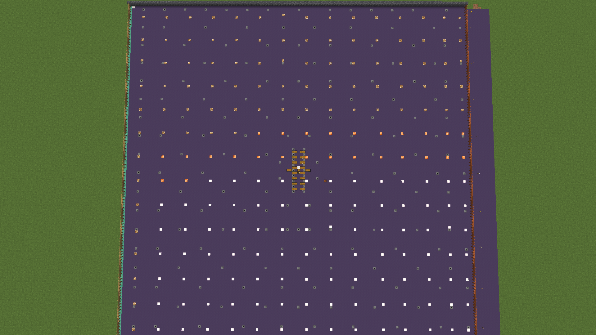
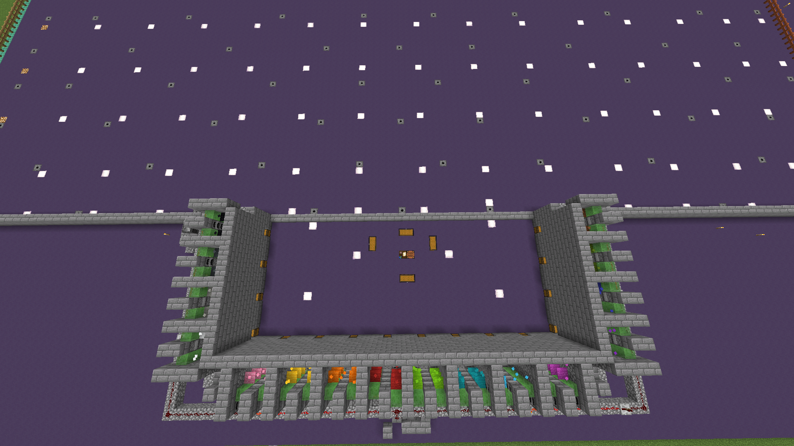

# Map Printer Addon

Map Printer Addon is an addon for the meteor client allowing you to build 2D carpet mapart from NBT files. It works 100% autonomously as long as the necessary materials are provided. Its main focus is reliability and compatibility with strict anti-cheat servers.
## Setup
To get the program running we first need to build an area where we will build one 1x1 map at a time. An area could look like this:

As you can see we need a restock station to refill the bot inventory. We can build one in the ground of the map area and refill it from below using droppers to minimize the path we need to walk to it. Alternatively, we can build a simpler restock station at the edge of the area as seen here:

Make sure it fulfills the following points:
- The fluid dispensers and lighting should cover the whole 128x128 MapArea.
- Avoid having grass blocks on the map area since it can lead to mobs spawning in certain biomes.
- The restock station should have a DumpChest, FinishedMapChest, MapMaterialChest, Reset Trapped Chest, and Cartography Table. I will explain later what the terms mean
- Avoid having the bot pick up old carpets while restocking. If you choose to build the restock station on the map area use lava at the restock station to delete the old carpets. For the other version use slabs to prevent the water from washing carpets into the station.
- Make sure the server loads the entire map when resetting
- If Phantoms are on you need a glass ceiling.
- If you play on hard difficulty don't forget the regeneration beacon
- **If the bot can not see the whole map from the DumpChest you need to install a mod that caches chunks to increase your render distance. This is necessary so the bot knows what carpets to restock. One mod I know for sure is compatible is [Bobby](https://www.curseforge.com/minecraft/mc-mods/bobby)**.

A litematica file with an example Map Area can be found [here](/Documentation/CarpetPrinterMapArea.litematic).

### Special blocks
Let's go over all the special blocks we need at the restock station.

#### DumpChest
The bot will fill this chest with carpets it doesn't need anymore. Make sure you empty it with 2 parallel hoppers/dispensers.

#### FinishedMapChest
Pretty self-explanatory. The bot will put the maps here.

#### MapMaterialChest
This chest should contain empty maps and glass panes for the bot to lock new maps.

#### Reset Trapped Chest
We use a trapped chest to activate the dispensers for a short amount of time. In contrast to a button, it is not destroyed by water, and we can easily confirm that the reset was activated.

### Load NBT files
When the module is started for the first time a "map-printer" folder is created in your Minecraft directory. Put in as many 2D 1x1 NBT files as you like. Keep in mind the bot will process them in alphabetical order.
## Workflow
The addon follows these 3 steps:

1. Register important blocks
2. Build Map
3. Create Map Item

### Register important blocks
The module will prompt you to interact with all necessary blocks. Chests only have to be selected once even though the rendered box might only highlight half of the chest. Once you are finished interact with the top left (-X, -Z) corner of the map area to start the next step. Every inventory slot containing nothing or carpets will be marked as a slot for future carpets.

### Build Map
The bot will build the map line by line. It calculates the maximum area he can cover with carpets using the free slots he has available and restocks accordingly. When one color is empty he dumps the remaining carpets into the DumpChest and the cycle repeats.

### Create Map Item
When the map is finished the bot grabs an empty map and glass pane from the MapMaterialChest and walks a small circle in the center to fill it. Depending on your render distance this step might be unnecessary. After storing the map the bot will trigger the reset and start with the next nbt file.
